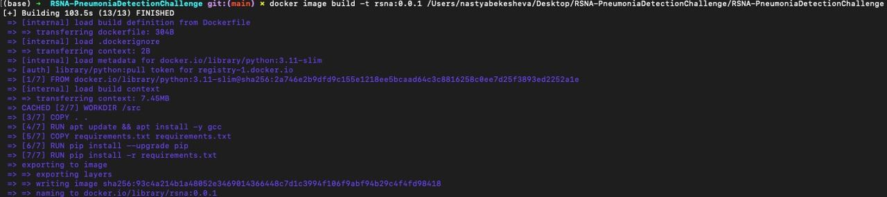
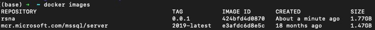

# RSNA-PneumoniaDetectionChallenge

## Table of contents

- [Preprocessing](#Preprocessing)
- [Training](#Training)
- [Deploying](#Deploying)
- [Visualizing](#Visualizing)

-----

### Preprocessing

For better performance of any model we need to preprocess the data. So here is what we did: 

1. Creating dataset of images classified as 'pneumonia positive' and background images. Background images are images with no objects that are added to a dataset to reduce False Positives.
2. Splitting dataset into training and validation.
3. Converted images from *.dcm to *.jpg (model requirement).
4. Prepared labels with coordinates for a center of bbox (model requirement). 

-----

### Training

#### Run train.py

```
python3 train.py path/to/dataset/
```
**Important note: your dir must contain stage_2_train_labels.csv and stage_2_train_images, stage_2_test_images dirs!** 

#### Training consisted of two stages:

1. Choosing the model:

We decided to explore versions of YOLO model, here is what we noted about the performance of different models:

| **Model** | **Minutes per epoch** | **Score** |
| :-------: | :-------------------: | :-------: |
| yolov8n.pt | 1 | 0.11549 |
| yolov8n.yaml | 1 | 0.11745 |
| yolov8s.pt | 1.5 | 0.12608 |
| yolov8m.pt | 3 | 0.12076 |
| yolov8.pt | 6 | 0.13297 |
| yolov8l.yaml | 6 | 0.12437 |

2. Training the model: Based on previous analysis we decided to train 'yolov8l.pt' model. Result are saved in weighs/best.pt

-----

### Deploying

First of all make sure that you have installed the latest version of Docker!
If you don't have Docker [click here to download](https://www.docker.com/products/docker-desktop/).

#### Step 1: Pulling the Docker Container

```
docker pull varcodex/shibarinu_pneumonia_inference:0.666
```



#### Step 2: Verify the Image Build

```
docker images
```



#### Step 3: Running the Docker Container

```
docker run --mount type=bind,source=/path/to/your/local/files,target=/input varcodex/shibarinu_pneumonia_inference:0.666 /input
```
------

### Visualizing


